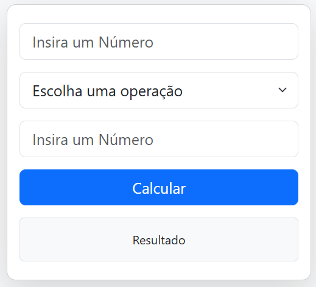

# 🧮 Calculadora Bootstrap

<div align="center">
    <a href="https://isaac-yuri.github.io/CalculadoraPWeb1/">
        
    </a>
</div>

> Calculadora simples feita com HTML, Bootstrap e Javascript.


## 🚀 Como Usar o projeto

Para acessar o projeto você pode clicar nesse <a href="https://isaac-yuri.github.io/CalculadoraPWeb1/">link</a> ou fazer um clone deste repositório, para fazer o clone execute o comando:


```
git clone https://github.com/Isaac-Yuri/CalculadoraPWeb1.git
```


## 📝 Licença

Esse projeto está sob licença. Veja o arquivo [LICENÇA](LICENSE.md) para mais detalhes.
